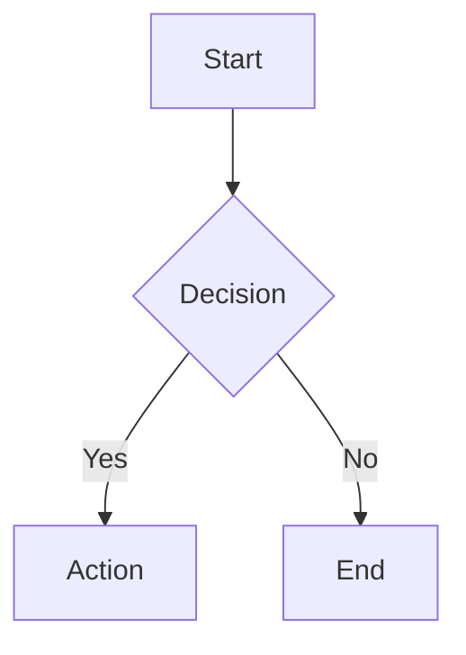

# Markdown Cheat Sheet

---

## Headings

**Syntax:**
```
# Heading 1
## Heading 2
### Heading 3
#### Heading 4
##### Heading 5
###### Heading 6
```

**Result:**

> # Heading 1
> ## Heading 2
> ### Heading 3
> #### Heading 4
> ##### Heading 5
> ###### Heading 6

---

## Text Formatting

**Syntax:**
```
**Bold text**
__Also bold__
*Italic text*
_Also italic_
***Bold and italic***
~~Strikethrough~~
==Highlighted==
`Inline code`
```

**Result:**

**Bold text**
__Also bold__
*Italic text*
_Also italic_
***Bold and italic***
~~Strikethrough~~
==Highlighted==
`Inline code`

---

## Links

**Syntax:**
```
[Link Text](https://example.com)
[Link with Title](https://example.com "Hover Title")
[[Internal Link]]
[[Internal Link|Display Text]]
<https://auto-linked-url.com>
```

**Result:**

[Link Text](https://example.com)
[Link with Title](https://example.com "Hover Title")
[[Internal Link]]
[[Internal Link|Display Text]]
<https://auto-linked-url.com>

---

## Images

**Syntax:**
```


![[embedded-image.png]]
![[embedded-image.png|300]]
```

**Result:** *(images render when valid paths are provided)*


---

## Lists

### Unordered

**Syntax:**
```
- Item A
- Item B
  - Nested item
    - Deeper nested
```

**Result:**

- Item A
- Item B
  - Nested item
    - Deeper nested

### Ordered

**Syntax:**
```
1. First
2. Second
   1. Nested
3. Third
```

**Result:**

1. First
2. Second
   1. Nested
3. Third

### Checklists

**Syntax:**
```
- [ ] Unchecked task
- [x] Checked task
```

**Result:**

- [ ] Unchecked task
- [x] Checked task

---

## Blockquotes

**Syntax:**
```
> Single line quote

> Multi-line quote
> continues here

> Nested
>> quote
```

**Result:**

> Single line quote

> Multi-line quote
> continues here

> Nested
>> quote

---

## Code

### Inline

**Syntax:**
```
Use `inline code` in a sentence.
```

**Result:**

Use `inline code` in a sentence.

### Fenced Block

**Syntax:**
````
```python
def hello():
    print("Hello, world!")
```
````

**Result:**

```python
def hello():
    print("Hello, world!")
```

Common languages: `python`, `javascript`, `bash`, `sql`, `json`, `yaml`, `html`, `css`, `java`, `cpp`, `rust`, `go`

---

## Tables

**Syntax:**
```
| Left Align | Center Align | Right Align |
|:-----------|:------------:|------------:|
| Left       |    Center    |       Right |
| data       |     data     |        data |
```

**Result:**

| Left Align | Center Align | Right Align |
|:-----------|:------------:|------------:|
| Left       |    Center    |       Right |
| data       |     data     |        data |

- `:---` left align
- `:---:` center align
- `---:` right align

---

## Horizontal Rules

**Syntax:**
```
---
***
___
```

**Result:** *(each produces a horizontal line)*

---

***

___

---

## Footnotes

**Syntax:**
```
Here is a sentence with a footnote.[^1]

[^1]: This is the footnote content.
```

**Result:**

Here is a sentence with a footnote.[^1]

[^1]: This is the footnote content.

---

## Math (LaTeX)

### Inline

**Syntax:**
```
$E = mc^2$
```

**Result:**

$E = mc^2$

### Block

**Syntax:**
```
$$
\sum_{i=1}^{n} x_i = x_1 + x_2 + \cdots + x_n
$$
```

**Result:**

$$
\sum_{i=1}^{n} x_i = x_1 + x_2 + \cdots + x_n
$$

---

## Callouts (Obsidian)

**Syntax:**
```
> [!note] Note Title
> This is a note callout.

> [!tip] Tip Title
> This is a tip callout.

> [!warning] Warning Title
> This is a warning callout.

> [!info] Info
> Informational callout.

> [!danger] Danger
> Danger callout.

> [!example] Example
> Example callout.

> [!quote] Quote
> Quote callout.

> [!abstract] Abstract
> Abstract callout.

> [!todo] Todo
> Todo callout.

> [!success] Success
> Success callout.

> [!question] Question
> Question callout.

> [!failure] Failure
> Failure callout.

> [!bug] Bug
> Bug callout.
```

**Result:**

> [!note] Note Title
> This is a note callout.

> [!tip] Tip Title
> This is a tip callout.

> [!warning] Warning Title
> This is a warning callout.

> [!info] Info
> Informational callout.

> [!danger] Danger
> Danger callout.

> [!example] Example
> Example callout.

> [!quote] Quote
> Quote callout.

> [!abstract] Abstract
> Abstract callout.

> [!todo] Todo
> Todo callout.

> [!success] Success
> Success callout.

> [!question] Question
> Question callout.

> [!failure] Failure
> Failure callout.

> [!bug] Bug
> Bug callout.

### Foldable Callouts

**Syntax:**
```
> [!note]+ Open by default
> This content is visible.

> [!note]- Collapsed by default
> This content is hidden until expanded.
```

**Result:**

> [!note]+ Open by default
> This content is visible.

> [!note]- Collapsed by default
> This content is hidden until expanded.

---

## Tags

**Syntax:**
```
#tag
#nested/tag
```

**Result:**

#cheatsheet-tag
#cheatsheet/nested-tag

---

## Embedding / Transclusion (Obsidian)

**Syntax:**
```
![[Note Name]]
![[Note Name#Heading]]
![[Note Name^block-id]]
```

**Result:** *(renders the content of the linked note inline when a valid note exists)*

---

## Block References (Obsidian)

**Syntax:**
```
This is a referenceable block. ^my-block-id

[[Note Name#^my-block-id]]
```

**Result:** *(creates an anchor on the block that other notes can link to)*

---

## Comments

**Syntax:**
```
%% This is a comment and won't render %%
```

**Result:**

%% This comment is invisible in reading view %%

*(Nothing appears above in reading view — that's the point!)*

---

## HTML (supported in most renderers)

**Syntax:**
```html
<kbd>Ctrl</kbd> + <kbd>C</kbd>
<sub>subscript</sub>
<sup>superscript</sup>
<mark>highlighted</mark>
<details>
<summary>Click to expand</summary>
Hidden content here.
</details>
```

**Result:**

<kbd>Ctrl</kbd> + <kbd>C</kbd>
Text with <sub>subscript</sub> and <sup>superscript</sup>
<mark>highlighted text</mark>
<details>
<summary>Click to expand</summary>
Hidden content here.
</details>

---

## Escaping Characters

**Syntax:**
```
\* \_ \# \[ \] \( \) \| \` \~ \> \!
```

**Result:**

\* \_ \# \[ \] \( \) \| \` \~ \> \!

---

## YAML Frontmatter

**Syntax:**
```yaml
---
title: My Note
tags: [tag1, tag2]
date: 2026-03-15
aliases: [alternate name]
cssclass: custom-class
---
```

**Result:** *(frontmatter is metadata — it does not render in reading view but populates note properties)*

---

## Mermaid Diagrams

**Syntax:**
````

````

**Result:**


---

## Definition Lists (some renderers)

**Syntax:**
```
Term
: Definition of the term

Another Term
: Its definition
```

**Result:**

Term
: Definition of the term

Another Term
: Its definition
